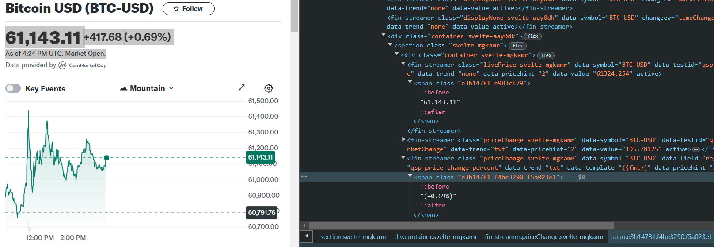
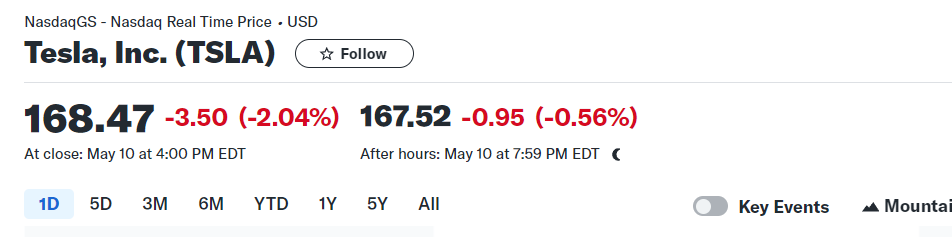
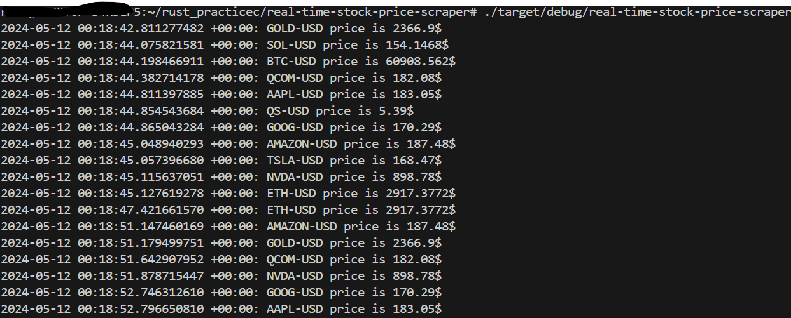

# Real-Time Stock Price Scraper

## Description
This Rust project scrapes Yahoo Finance website to fetch real-time stock prices and displays them in the terminal.

## Preview





## Installation
1. Make sure you have Rust installed. If not, you can download it from [rust-lang.org](https://www.rust-lang.org/).
2. Clone this repository:
   ```
   git clone <repository_url>
   ```
3. Navigate to the project directory:
   ```
   cd real-time-stock-price-scraper
   ```
4. Build the project:
   ```
   cargo build
   ```

## Usage
To run the program, execute:
```
cargo run
```

